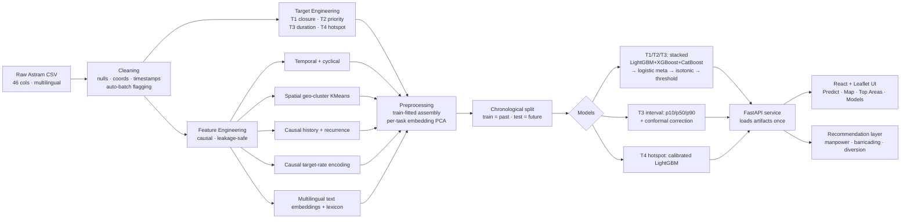

# Gridlock — Hackathon Presentation Content

> Page-by-page deck content for **Gridlock: Event-Driven Congestion Forecasting &
> Resource Recommendation**. Each page gives **more content than you need** — pick
> the lines that land hardest. Brag points and suggested visuals are called out per
> page. A design/theme guide is at the end.
>
> **Deck length:** 6 core content pages (+ title + closing). Pages 7–8 are optional
> add-ons if you have time/space.
>
> **The one-sentence pitch (memorize this):**
> *"We turned a raw, unlabeled Bengaluru traffic-event log into a live decision-support
> tool that tells a control room — before an incident escalates — how long it will last,
> whether it needs a closure, how many officers to send, and which spots will keep
> reoffending."*

---

## TITLE PAGE (excluded from the 5–6 count)

- **Gridlock**
- Tagline options (pick one):
  - *"From raw event log to operational foresight."*
  - *"Stop firefighting traffic. Start forecasting it."*
  - *"Predict the impact. Pre-position the response."*
- Sub-line: Event-driven congestion forecasting & resource recommendation for Bengaluru
- Team name · Hackathon name · Date
- Visual: a dark Bengaluru map with a few glowing hotspot markers (screenshot from the Map tab).

---

## PAGE 1 — Problem & Solution (keep it punchy)

**Headline:** *"Traffic control today is reactive. We make it predictive."*

### The problem (2–3 lines max — judges know traffic is bad)
- Every road event — an accident, a procession, construction, a pothole, water-logging —
  forces a control room to make fast calls: **Do we close the road? Divert? How many
  officers? How long will this tie up the corridor?**
- Today those calls are **reactive and experience-based**. By the time the response is
  sized correctly, the congestion has already cascaded.
- The data to do better exists — but it ships as a **raw event log with no "impact"
  label**, riddled with leakage and multilingual free text.

### Our solution (this is what they care about)
- **Gridlock** forecasts an event's impact **at the moment it's reported** and converts
  that forecast into **concrete operational actions**.
- Four predictions, four decisions:
  | We predict | We recommend |
  |---|---|
  | Will it need a **road closure / diversion**? | Barricading + diversion plan |
  | **High vs low** operational priority | Manpower **tier** |
  | **How long** until it clears (with an interval) | Officer count + clearance ETA |
  | Will this spot **keep reoffending**? | Send a **root-cause fix**, not another patrol |
- Delivered as a **live, deployed web app** — not a notebook. Enter what's known at report
  time, get a calibrated forecast + a recommended response in one click.

### Brag line to drop here
> *"Most teams were handed a labeled dataset and trained a classifier. We were handed a
> raw operational log and had to **define the problem itself** — engineer the targets,
> strip the leakage, and ship a product."*

**Suggested visual:** a simple before/after — "Reactive (today): incident → escalation →
scramble response" vs "Gridlock: incident → instant forecast → pre-sized response."

---

## PAGE 2 — Application Flow & System Architecture (overview)

**Headline:** *"One raw CSV in. Four calibrated decisions out. End-to-end."*

### The flow in plain language
1. **Ingest** the raw Astram event log (46 columns, multilingual, messy).
2. **Clean** it into a typed, sane frame (nulls, coordinates, timestamps).
3. **Engineer four targets** that don't exist in the data.
4. **Build leakage-safe features** computable only from report-time info.
5. **Train four models** (three operational + one forward-looking early-warning).
6. **Serve** predictions + recommendations through a FastAPI backend and a React UI.

### The product surface (4 tabs)
- **Predict** — forecast a single event → manpower/closure/duration/hotspot + action plan.
- **Map** — Bengaluru-wide congestion, chronic hotspots, closure risk and manpower load.
- **Top Areas** — every police-station area ranked by risk, fully sortable.
- **Models** — the evidence: metrics, calibration, operating points, feature importance.

### Stack at a glance (shows engineering breadth)
- **ML:** LightGBM · XGBoost · CatBoost · scikit-learn · Optuna · sentence-transformers (PyTorch)
- **Backend:** FastAPI + Uvicorn, single in-process model service (loads once at startup)
- **Frontend:** React + TypeScript + Vite + TailwindCSS + Radix UI + Leaflet + Recharts
- **Delivery:** one multi-stage **Docker** image, **deployed live on Hugging Face Spaces**

### Brag line
> *"From a raw CSV to a containerized, publicly deployed decision tool — the full ML
> lifecycle, not just a model.fit()."*

**Suggested visual:** a horizontal pipeline ribbon (CSV → Clean → Targets → Features →
Models → API → UI) sitting above three screenshots of the app tabs. Or use the Mermaid
diagram from Page 4 in a simplified form here.

---

## PAGE 3 — The Dataset: Problems We Hit & How We Solved Them

**Headline:** *"The hard part wasn't the model — it was making the data tell the truth."*

### The dataset
- **Astram** anonymized traffic-event log, Bengaluru.
- **8,173 raw → 8,057 clean** events; **9 Nov 2023 → 8 Apr 2024** (~150 days); **46 columns**.
- Mix of **planned** (processions, VIP movement, construction) and **unplanned**
  (accidents, breakdowns, potholes, tree-fall, water-logging) events.

### The problems → our solutions (this table is the star of the page)
| # | Problem in the raw data | What we did |
|---|---|---|
| 1 | **No "impact" label exists** | Engineered **4 targets** from scratch (closure, priority, duration, chronic hotspot) |
| 2 | **Duration isn't a column** | Reconstructed it by coalescing `resolved → closed → end` minus start time |
| 3 | **Leakage everywhere** — end-point coords & `route_path` are filled in *after* a closure is drawn | Partitioned them into `LEAKAGE_COLUMNS`; **never used as features** |
| 4 | **Many spellings of NULL** | Normalized every null token to real `NaN` |
| 5 | **Sentinel / out-of-range coordinates** (0,0 placeholders, data-entry noise) | Clamped to a Bengaluru bounding box (lat 12.6–13.4, lon 77.2–77.9), bad → `NaN` |
| 6 | **Fake "auto-resolved" timestamps** from a nightly batch job (e.g. :35:47) | Detected and flagged them so they don't poison the duration label |
| 7 | **Severe class skew** — closures are only ~7% of events | Skew-aware metrics + calibration + tunable thresholds (not accuracy) |
| 8 | **Multilingual free text** — English + Kannada + transliterated Kannada | Multilingual sentence-transformer embeddings + an interpretable bilingual lexicon |
| 9 | **Bimodal duration** — minutes for incidents, **weeks** for construction | Log-target point model + uncapped quantile models for honest intervals |

### THE signature story — tell this out loud
> *"The single biggest trap: the end-point coordinates 'predict' a closure with ~98%
> average precision. But they only exist **because** someone already drew the diversion —
> it's the answer leaking back into the question. We **deliberately deleted our most
> powerful feature** because using it would be cheating. That discipline is the difference
> between a demo and a deployable model."*

### Brag line
> *"We didn't just clean data — we defended it. Every feature is causal: a row only ever
> sees events reported **before** it. No future leaks backward."*

**Suggested visual:** the problem→solution table; or a striking "leakage caught" callout —
"Feature that scored AP ≈ 0.98 → removed on purpose."

---

## PAGE 4 — System Architecture Diagram

**Headline:** *"A leakage-safe pipeline, four models, one service."*

### Drop this diagram (renders in Markdown/Mermaid; or redraw in your deck tool)



### If you redraw it by hand, keep these three "lanes"
1. **Data lane (left):** CSV → Cleaning → Targets + Features (call out "causal / leakage-safe").
2. **Model lane (middle):** Chronological split → 4 models (highlight the stacked ensemble box).
3. **Product lane (right):** FastAPI → React UI + Recommendation layer → Docker/HF Spaces badge.

### Architecture talking points (say these while the diagram is up)
- **Multi-task by construction, not a fragile multi-head net** — three separately tuned
  models share **one** feature pipeline. Robust and independently debuggable.
- **Train on the past, test on the future** — a chronological split, the only honest way
  to evaluate something that will run live.
- **Everything fitted is fitted on training rows only** — vocabularies, PCA, calibration,
  thresholds. The future never touches the fit.
- **The model service loads once** — all artifacts warm in memory; predictions are instant.

### Brag line
> *"This isn't a notebook with cells run top-to-bottom. It's a modular pipeline with
> explicit leakage boundaries, persisted artifacts, and a deployable inference service."*

**Suggested visual:** the Mermaid diagram (export to PNG/SVG), or a clean 3-lane redraw.
Color the "leakage-safe" boundary in your accent color to make the discipline visible.

---

## PAGE 5 — Training Process & Model Choices

**Headline:** *"Three decorrelated boosters, stacked, calibrated, and turned into policy."*

### The recipe (per operational task T1–T3)
```
Optuna-tuned LightGBM  ┐
Optuna-tuned XGBoost   ├─►  logistic meta-learner (on out-of-fold preds)
Optuna-tuned CatBoost  ┘        └─► isotonic calibration └─► decision threshold
```
- **Why three boosters?** They make different errors. Stacking decorrelated learners
  beats any single model — and we tuned each with **Optuna**, not hand-picked params.
- **Why a logistic meta-learner on out-of-fold predictions?** It learns how to trust each
  base model **without leaking** — the stack never sees a row's own training fold.
- **Why isotonic calibration?** So a "30% closure risk" actually means 30%. Calibrated
  probabilities are what let a control room **act on the number** (Brier scores prove it).
- **Why a separate threshold step?** Because the cutoff is an **operational policy**, not a
  modeling constant — see the operating points below.

### Duration is special (heavy-tailed → honest intervals)
- Point estimate on a **log target** (winsorized) so multi-week construction doesn't
  dominate the fit.
- Separate **p10 / p50 / p90 quantile models** + a **conformal correction** → an honest
  **80% prediction interval** (empirically covers ~78%). We give a *range*, not false precision.

### The 4th model — our differentiator (T4: chronic hotspot early warning)
- **Engineered from scratch:** at report time, will this **~110 m spot generate ≥2 more
  events in the next 14 days?**
- Strictly causal — features use only earlier events, the label uses only later events,
  **disjoint time windows**, right-censored rows dropped.
- Operationally it flips the game: **stop re-patrolling the same junction; send a permanent
  fix** (drainage, resurfacing, a marshal).

### Headline results (chronological hold-out — put these big on the slide)
| Task | Metric | Result | Why it's good |
|---|---|---|---|
| **T2 Priority** | PR-AUC | **0.984** (MCC 0.90) | Near-perfect manpower-tier signal |
| **T1 Closure** | PR-AUC | **0.326** | **4.5× the 7% base rate**; ROC-AUC 0.835; Brier 0.057 (calibrated) |
| **T3 Duration** | log-R² / median err | **0.251 / 74 min** | Honest fit on a heavy-tailed target; 80% interval covers 78% |
| **T4 Hotspot** | PR-AUC / recall | **0.441 / 0.875** | **2.8× base**; catches **189 of 216** emerging hotspots — only 27 missed |

### Operating points = ML framed as policy (this impresses judges)
- The closure model isn't one number — we expose **risk postures** the control room chooses:
  | Posture | Recall | Precision | Use when |
  |---|---|---|---|
  | Balanced (MCC-optimal) | 0.51 | 0.40 | Normal ops |
  | Recall-leaning (deployed) | 0.66 | 0.28 | Don't miss closures |
  | Never-miss (recall ≥ 0.8) | 0.83 | 0.15 | VIP / high-stakes days |

### Intellectual-honesty brag (rare in hackathons — use it)
> *"We report **two** R² numbers for duration and tell you which one is honest. We admit
> the model can't predict brand-new locations with no history — and show it correctly
> assigns them low risk instead of inventing signal. We'd rather be **trusted than
> impressive.**"*

### Brag line
> *"Per-task Optuna tuning, out-of-fold stacking, isotonic calibration, conformal
> intervals, and threshold-as-policy — this is a production ML playbook, executed in a
> hackathon."*

**Suggested visual:** the stacked-ensemble diagram + the 4-result table; optionally embed
the real PR / calibration / SHAP plots from `reports/figures/` to prove it's measured.

---

## PAGE 6 — UI Snippets (the product, live)

**Headline:** *"The science is invisible. The decision is one click away."*

### Tab 1 — Predict ("Forecast an event")
- Enter only what's known at report time: **location + start time required; everything else
  is optional and just sharpens the forecast.**
- Pick a police station → the map pin and coordinates **auto-fill**; or drop a pin manually.
- Output is a **decision panel**, not a JSON dump:
  - **Manpower hero**: HIGH / MEDIUM / LOW + suggested officer count.
  - Cards: **closure probability** (gauge + expected badge), **priority**, **duration**
    (point estimate **+ 80% interval band**), **chronic-hotspot risk + flag**.
  - **Barricading**, **diversion**, and a plain-English **rationale** line.
- Every metric has an **(i) info popover** explaining what it means and why it's good.

### Tab 2 — Map (Bengaluru, dark)
- Four switchable views: **Congestion**, **Chronic hotspots (~110 m cells)**, **Closure
  risk**, **Manpower load**.
- Heat layer + per-station markers with **stat popups**; auto-fits to the city; dark/light
  basemaps (CARTO). It looks like a real ops dashboard.

### Tab 3 — Top Areas
- Every **police-station area** (54 of them) ranked by a blended **risk score**.
- Fully **sortable** columns: #events, risk, avg duration, closure rate, high-priority
  rate, avg manpower. Find the worst corridors in two clicks.

### Tab 4 — Models (the receipts)
- Sub-tabs **Priority · Closure · Duration · Hotspot**, each with headline metric, a metric
  grid with info popovers, **PR / calibration / SHAP** charts, confusion matrix, operating
  points, base-learner comparison, and feature importance.
- Translation: **"don't take our word for it — here's the evidence."**

### Brag line
> *"A polished, dark-themed, fully responsive product with an interactive city map and a
> self-documenting model report — built and **deployed**, not mocked up."*

**Suggested visual:** 3–4 real screenshots (Predict result panel, the dark Map with
hotspots, the sortable Top Areas table, one Models sub-tab). Annotate the Predict panel
with callouts ("calibrated probability", "80% interval", "recommended action").

---

## PAGE 7 — Conclusion & Impact

**Headline:** *"From reacting to incidents to pre-empting them."*

### What we built (recap in one breath)
- A **leakage-safe, multi-task ML pipeline** that engineers four decision-grade forecasts
  from a raw, unlabeled event log — wrapped in a **live, deployed decision-support app**.

### Why it matters (impact — frame as outcomes, not features)
- **Proactive resourcing:** size manpower and pre-stage barricading/diversion **before**
  congestion cascades, not after.
- **Trustworthy numbers:** calibrated probabilities + honest intervals mean a control room
  can **act on the output** instead of second-guessing it.
- **Policy-aware:** operating points let commanders dial risk posture up on VIP/festival
  days and back down on routine days — same model, different stance.
- **Break the firefighting loop:** the chronic-hotspot model redirects effort from
  **repeatedly patrolling** the same pothole/junction to **fixing it once** — compounding
  savings over time.
- **Equity & planning:** the Top-Areas view surfaces chronically under-served corridors for
  capital planning (resurfacing, drainage, signal upgrades).

### The differentiators, restated (your closing brag)
1. We **defined the problem** (engineered 4 targets) — most teams only solved a given one.
2. We **deleted our strongest feature** to kill leakage — ML maturity over a vanity score.
3. We **calibrated and bounded** every prediction — trust, not just accuracy.
4. We shipped a **forward-looking 4th model** no one asked for — root-cause, not firefight.
5. We **deployed a real product**, end-to-end, in a container, on the public web.

### Closing line options
- *"Gridlock doesn't just predict traffic — it tells a city where to stand before the jam
  forms."*
- *"We turned a messy CSV into foresight a control room can act on."*

**Suggested visual:** a clean "Reactive → Predictive" arrow with the five differentiators as
icons; or the live deployment URL as a QR code so judges can open it themselves.

---

## PAGE 8 (OPTIONAL) — Future Work & Real-World Deployment

**Headline:** *"Already live. Here's how it scales into the control room."*

### It's already deployed
- Runs as a single **Docker** image, **live on Hugging Face Spaces** (free 16 GB tier) —
  judges can use it **right now**. (Same image runs unchanged on Render, AWS, GCP, Azure.)

### Productionization roadmap
- **Live ingestion:** connect to the real-time Astram feed → forecasts the moment an event
  is logged.
- **Feedback loop / online learning:** capture actual outcomes → continuously recalibrate
  thresholds and refresh models (drift-aware).
- **Context fusion:** add **weather**, **event calendars**, and **match/festival schedules** —
  strong exogenous drivers of impact.
- **Route-level diversion optimizer:** turn the closure prediction into an actual
  **graph-based diversion plan** over the road network.
- **Field app:** push the manpower/barricading recommendation to **officers' phones**.
- **Cold-start fix:** external priors (road class, land use) so brand-new locations get a
  sensible first estimate.
- **Multi-city transfer:** the pipeline is city-agnostic — retrain on any event log.

### IRL integration story (say this)
- **API-first**, so Gridlock **slots into the existing control-room dashboard** rather than
  replacing it.
- Lightweight enough for **CPU-only** inference — no GPU bill to run it in production.

### Brag line
> *"This isn't a prototype hoping to become a product. It's a deployed product with a
> credible path into a live traffic-operations center."*

**Suggested visual:** a roadmap timeline (Now: deployed → Next: live feed + weather → Later:
diversion optimizer + field app) or an integration diagram (Astram feed → Gridlock API →
control-room dashboard + officer app).

---

## DESIGN / THEME GUIDE (optional, but it sets you apart)

### Theme
- **Dark, operational, "control-room" aesthetic** — it matches the live app, so the deck and
  product feel like one thing. Judges remember cohesive branding.
- **Palette** (from the app):
  - Background: near-black slate `#0B0F14` / `#111827`
  - Surfaces/cards: `#1A2230` with subtle borders `#2A3442`
  - Text: off-white `#E6EDF3`, muted `#9AA7B4`
  - **Risk ramp** (reuse everywhere for instant legibility): green `#4F9E7D` → amber
    `#CFA247` → orange `#DB8A52` → red `#D35F55`
  - Accent (links/highlights): a cool blue→green, echoing the app's `colorFrom: blue,
    colorTo: green`.
- **Fonts:** a clean geometric sans for headers (Inter / Space Grotesk / Sora), a mono
  accent (JetBrains Mono / IBM Plex Mono) for metrics and code-y callouts.

### Layout principles
- **One idea per slide.** A bold headline (the tagline), then ≤5 bullets. Park detail in
  speaker notes — you have far more content here than any single slide should show.
- **Lead with the number.** Make `0.984`, `4.5×`, `189 / 216`, `74 min` huge; caption small.
- **Show, don't tell:** real screenshots and the real PR/calibration/SHAP plots beat clip-art.
- **Consistent iconography:** reuse the app's Lucide icons (Flame = hotspot, Users =
  manpower, ShieldAlert = closure, Clock = duration, Gauge = probability) so visuals map 1:1
  to concepts across deck and product.
- **A persistent footer chip:** tiny "Gridlock · live on Hugging Face Spaces" + URL/QR on
  every slide — quietly reminds judges it's real and runnable.

### Visual assets you already have (use them)
- `reports/figures/priority_pr_calibration.png`, `priority_shap_summary.png`
- `reports/figures/closure_pr_calibration.png`, `closure_best_pr_calibration.png`,
  `closure_shap_summary.png`
- Live app screenshots: Predict result panel, dark Map with hotspots, Top-Areas table,
  Models sub-tabs.
- The Mermaid architecture diagram on Page 4 (export to PNG/SVG).

### Tooling tips
- **PowerPoint/Keynote:** build one master "dark + risk-ramp" theme, then duplicate slides —
  consistency reads as polish.
- **Prefer Google Slides / pretty templates?** Gamma, Pitch, or Canva all do dark decks
  well; paste these bullets and swap in the screenshots.
- Export the Mermaid diagram at [mermaid.live](https://mermaid.live) if your tool can't
  render it natively.

---

### Quick mapping back to your outline
| Your ask | Page here |
|---|---|
| Problem (short) + solution brief | **Page 1** |
| Application flow + system architecture (overview) | **Page 2** |
| Dataset: problems + solutions | **Page 3** |
| System architecture **diagram** | **Page 4** |
| Training process + model choices | **Page 5** |
| UI snippets | **Page 6** |
| Conclusion + impact | **Page 7** |
| Future work + real-world deployment (optional) | **Page 8** |

> Tight on space? Merge **Page 2 into Page 4** (flow + diagram together) and you land at a
> crisp **6 content pages**: Problem/Solution · Dataset · Architecture · Models · UI ·
> Conclusion.
